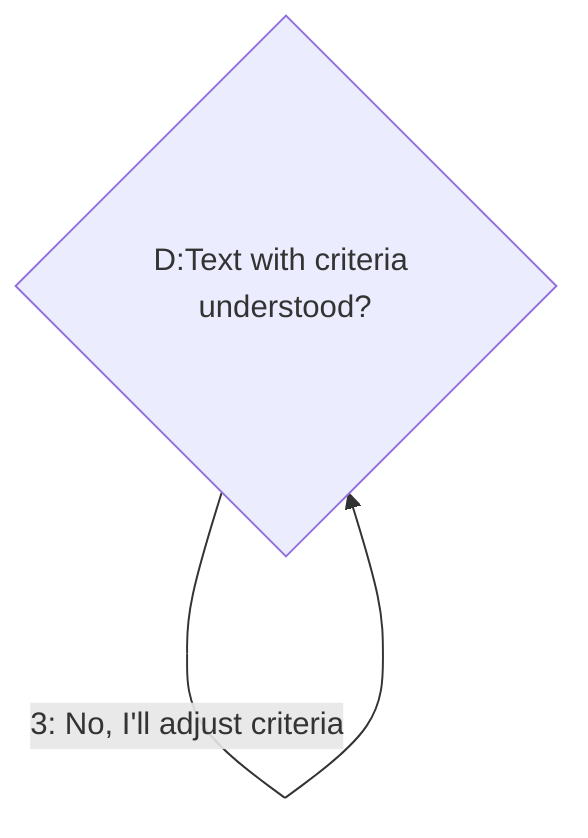
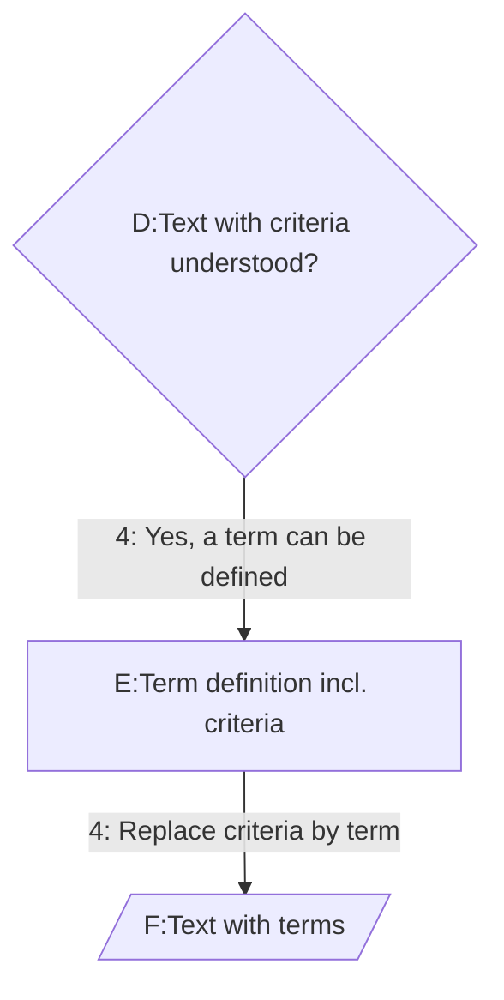
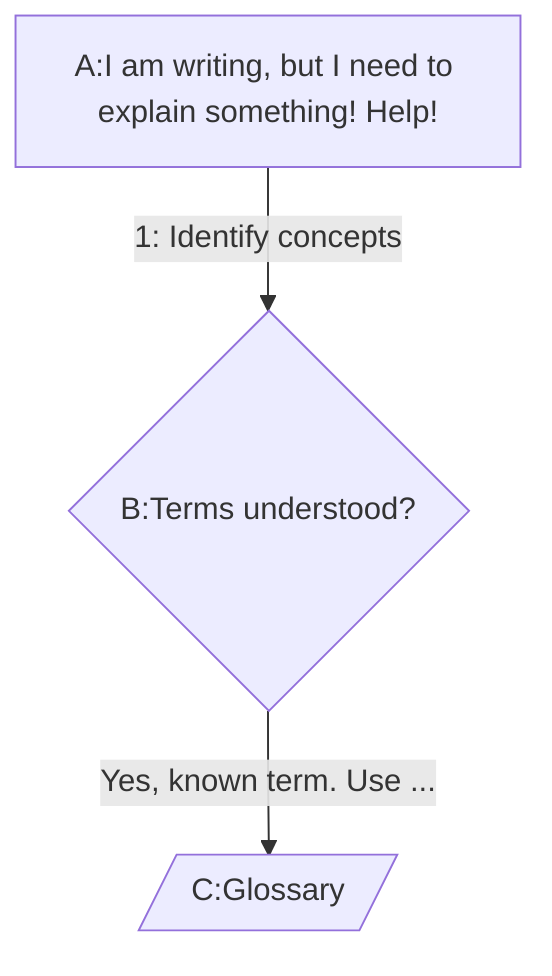

import useBaseUrl from '@docusaurus/useBaseUrl'

# Design Principles

## Summary
You need to understand first, to be understood.

## Terminology design aids

 “Why do we need to design terminology? Can’t we simply write our ideas down, look up some definitions and add them, or search for some explanatory texts if clear definitions lack in the heat of the writing process?"

 "We don’t have a problem, do we? Why all the fuzz and juggling all these terms and definitions about terms and definitions? It’s not getting better, is it?

 "Please let me just write my document and add some glossary items and we’re done. We skip all the academic hassle about *meaning, concepts, artefacts* and what have we. Let’s get work done!”

### Do not proceed if

You recognize a few of those remarks above? If communication and understanding each other were just that easy, we could leave the hard part out. But **we can't skip the design of terminology** if we want to convey a (new) concept.

**Please do not proceed with this Method if you're a sender, only sending or broadcasting.**

Because you need to understand first, to be understood.

### Principles

#### Iterate through concepts

The idea is that anyone willing to explain some concepts by (first) understanding the perception of the receiving party will go through this loop for every term that is unclear, conflates, or is otherwise not fully understood.

::: note At least one criterium?
At least one clear generally applicable criterium should come out of this step-by-step per term.
:::

1. Start writing your objectives and ideas, and identify the concepts behind the terms you use ([why](#why-objectives)-[what is it](#what-identifying)?) 
2. Write the concept in a specific way: formulate criteria ([why](#why-criteria)-[how](#how-criteria)-[what is good](#what-good-criteria)?) when you expect confusion to arise
3. As long as a term is not understood by the target group: replace it with your criteria ([why](#why-replace)-[how](#how-replace)?) 
4. As soon as it’s understood: define the term with those criteria and replace the criteria in the text with the term. ([why]((#why-back-terms)-[how](#how-back-terms)?) 

#### 1. Start writing your objectives and ideas, and identify the concepts behind the terms you use 

##### why writing your objectives and ideas down [#why-objectives]
You want to be understood and seek support for your plans or ideas. To guide this process, it's good to have a reference.

##### what is "identifying a concept"? [#what-identifying]
An identifier points to something, in this case to a concept. Identification is the process of clearly describing what the concept is and defining the term that points to it.

#### 2. Write the concept in a specific way: formulate criteria when you expect confusion to arise

##### why criteria? [#why-criteria]
Another person should be able to apply wording to a certain concept and then be able to independently decide whether something falls in or out of the criterium. Example: if a stool is defined with the criterium "all furniture to comfortably sit on with exactly 3 legs from seat to each non-fixed contact point of the leg on the floor", then anyone could (dis)qualify various instances of something to sit on that looks like a stool to many.
Although you might not fully agree that a 4-legged stool is no stool according to this definition with this criterium, the fact is that it's the generally applicable criterium that we were looking for.

###### Stools IN the criterium

###### Stools OUTSIDE the criterium

::: note Important consideration
Communication, understanding and learning will sky rocket with clear criteria, invest time in them and earn time back further down the road.
:::

Example: moving stools

If a group of people had to move every stool, but only stools, from a furniture warehouse into a large lorry without clear criteria what a stool is and isn't, you will end up leaving stools behind and for sure bringing back half a lorry of furniture upon unloading.

##### how to formulate criteria [#how-criteria]

In text. And you could add examples to a criterium of edge cases / corner cases: what falls just in the criterium and what is just outside?

##### what are good criteria? [#what-good-criteria]

Criteria that are determistic and clearly distinguish something.

#### 3. As long as a term is not understood by the target group: replace it with your criteria

##### why replace terms by criteria? [#why-replace]

Criteria can be independently applied, terms have a aledged meaning and interpretation might of terms might point to distinctive concepts.
Example: *move the stools into the van* might be interpreted as "break out the fixed stools in the cantina and bring the remnants to the van".

##### how to replace terms by criteria? [#how-replace]

Simply replace the term by the sentences criteria might consist of.

Example: *move the stools into the van* -> *move into the van all furniture to comfortably sit on with exactly 3 legs from seat to each non-fixed contact point of the leg on the floor*

#### 4. As soon as it’s understood: define the term with those criteria and replace the criteria in the text with the term.

##### why put back terms [#why-back-terms]

Once you've succesfully identified a concept for all stakeholders, it makes no sense to maintain repetitions of lengthy criteria descriptions in a text. Maitenance of the criteria is also easier with a single point of defnition. 

##### how to put back terms [#how-back-terms]

Be sure to create a Terminology definition with the criteria and identify this concept with the term intended.

For example:

[[def: stool, stools]]
 ~ furniture to comfortably sit on with exactly 3 legs from seat to each non-fixed contact point of the leg on the floor

AND then change the concept criteria in the text with the concept term:

move the [[ref: stools]] into the van.

##### Next time 
You might come across a concept that has already been identified and defined with a term + criteria:

